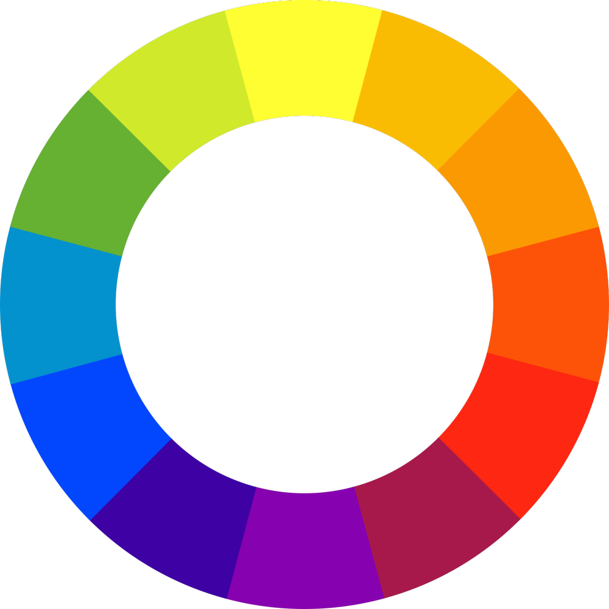

# Color Theory

_Warning: This a study report, all the articles used as basis are linked at the end._

Color is an important element of design, it has a huge influence in human behavior, evoking a particular feeling, vibe or aesthetic. Color Theory is both the science and art of using color. It explains how humans perceive colors and the visual effects of mix, match or contrast with each other.

### Additive color

The additive color mixing model \*\*\*\*allows you to create colors by mixing red, green and blue light sources of various intensities. The more light you add, the brighter the color mix becomes. If you mix all three colors of light, you get pure, white light.

TVs, screens and projectors use RGB as their primary colors, and then mix them together to create other colors.

### Subtractive color

Any color you see on a physical surface (paper, signage, packaging, etc.) uses the subtractive color mixing model. Most people are more familiar with this color model because it’s what we learned in kindergarten when mixing finger paints. In this case, “subtractive” simply refers to the fact that you subtract the light from the paper by adding more color.

Traditionally, the primary colors used in subtractive process were red, yellow and blue, as these were the colors painters mixed to get all other hues. As color printing emerged, they were subsequently replaced with cyan, magenta, yellow and key/black (CMYK), as this color combo enables printers to produce a wider variety of colors on paper.

### Color wheel

The color wheel consists of three **primary colors** (red, yellow, blue), three **secondary colors** (colors created when primary colors are mixed: green, orange, purple) and six **tertiary colors** (colors made from primary and secondary colors, such as blue-green or red-violet).

Draw a line through the center of the wheel, and you’ll separate the **warm colors** (reds, oranges, yellows) from **cool colors** (blues, greens, purples). Warm colors are generally associated with energy, brightness, and action, whereas cool colors are often identified with calm, peace, and serenity.

### Monochromatic

Monochromatic color schemes use a single color with a varying shades and tints to produce a consistent look and feel. It provides a subtle and conservative color combination.

### Analogous

Analogous colors sit next to one another on the color wheel. To balance an analogous color scheme, choose one dominant color, and use the others as accents.

### Complementary

Complementary color scheme is based on the use of two colors directly across from each other on the color wheel and relevant tints of those colors. This combination provides a high contrast and high impact color combination.

### Triadic

Triadic colors are evenly spaced around the color wheel and tend to be very bright and dynamic. This provides a high contrast color scheme, but less so than the complementary color combination.

## References

99design - [https://en.99designs.com.br/blog/tips/the-7-step-guide-to-understanding-color-theory/](https://en.99designs.com.br/blog/tips/the-7-step-guide-to-understanding-color-theory/)

Hubspot - [https://blog.hubspot.com/marketing/color-theory-design#what-is-color-theory](https://blog.hubspot.com/marketing/color-theory-design#what-is-color-theory)

Canva - [https://www.canva.com/colors/color-wheel/](https://www.canva.com/colors/color-wheel/)
