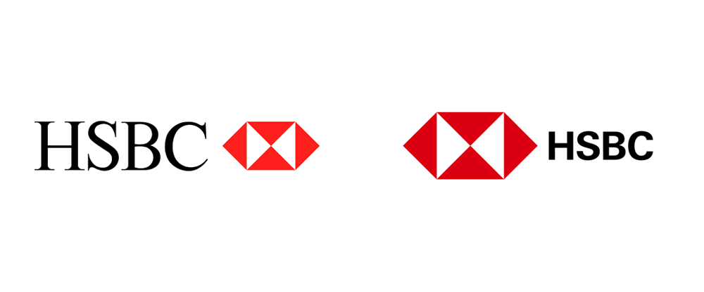
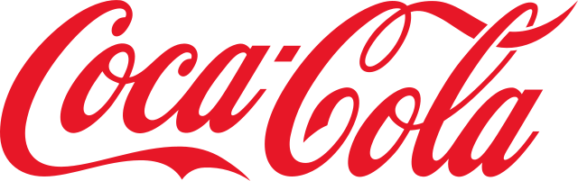

# Basic Typography

_Warning: This a study report, all the articles used as basis are linked at the end._

Typography plays a vital role in our day-to-day lives, we see and use it whether we're sending a text, reading an article or a book. The Oxford Languages defines Typography as "The art and process of designing typeset material, including the choice of fonts (see also typeface personality), legibility, leading, kerning, layout, and the use of white space."

Typography has two main purposes, promote legibility and help communicate the messaging, tone, and sentiment of a design piece.

### Font vs. Typeface

The terms "typeface" and "font" are often used interchangeably, but in fact, those terms are distinctive, while **typeface** is a family of fonts (e.g. Helvetica), **font** is a variation of a typeface (e.g. Helvetica Bold).

### Size

A typeface can be applied in all different sizes and can be used to create visual hierarchy. Visual hierarchy is an important function of the legibility os text.

### Weight

A font's weight determines how thick or thin characters are displayed. Using different font weights is great to create contrast, improving the legibility of the text.

## Type Anatomy

### Ascender

The ascender is the vertical stem that extends above the mean line of a font. In other words, the taller part of a lowercase letter or the upper portion of an uppercase letter.

### Descender

The descender is the portion of the letter that extends below the baseline of a font.

### Baseline

The baseline is the line on which most letters sit and below which descenders extend.

## Main categories

There are basically 5 main typeface categories, Serif, Sans Serif, Script, Display and Monospaced. Generally, serif and sans typefaces are used for eithe or headlines (titles, logos, etc.), while scrpit and display typefaces are only used for headlines.

### Serif

Serif is a typeface with small decorative edges at the ends of the letters. They have a more traditional and sophisticated look.

### Sans Serif

Sans Serif is a geometric typeface with no decorative details at the end of the letters. They have a modern and minimalist look. Its normally used by tech companies, like Google and Facebook.

In recent years, a number of high-profile companies have been changing their logos to appear more modern and accessible, shifting from Serif typefaces to Sans Serif. Google and HSBC are great examples of brands that abandoned Serif.

### **Script**

A script font mimics the stroke of a paintbrush, often linking letters together. Script typefaces create a dynamic and interesting pairing when combined with a sans serif.

## References

Canva - [https://www.canva.com/learn/typography-guide/](https://www.canva.com/learn/typography-guide/)

Canva - [https://www.canva.com/learn/serif-vs-sans-serif-fonts/](https://www.canva.com/learn/serif-vs-sans-serif-fonts/)

Carrer Foundry - [https://careerfoundry.com/en/blog/ui-design/beginners-guide-to-typography/](https://careerfoundry.com/en/blog/ui-design/beginners-guide-to-typography/)

Futura Express - [https://www.futuraexpress.com.br/blog/o-que-e-tipografia/](https://www.futuraexpress.com.br/blog/o-que-e-tipografia/)

Flux Academy - [https://www.flux-academy.com/blog/why-is-typography-important-in-graphic-design](https://www.flux-academy.com/blog/why-is-typography-important-in-graphic-design)
